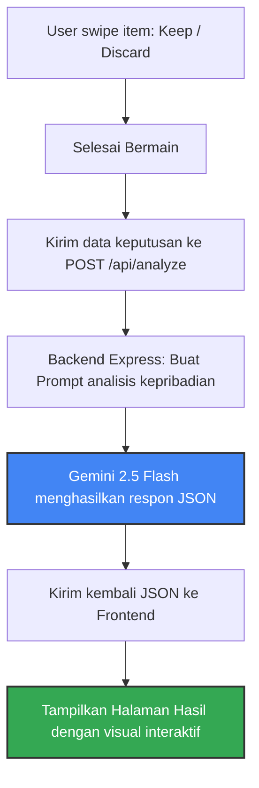

# ✦ SwipeQuest ✦
### *AI-Powered Fun Personality Playground*

**SwipeQuest** adalah aplikasi web interaktif berbasis game "Pilih atau Buang" (Swipe Left/Right) yang dibangun menggunakan **React (Vite)** di bagian frontend dan **Express.js** di backend, serta ditenagai oleh **Google Gemini 2.5 Flash** untuk menghasilkan analisis kepribadian yang humoris, modern, dan bernuansa lokal Indonesia. 

Dokumen ini berisi panduan teknis lengkap tentang cara mengonfigurasi, menjalankan proyek di lingkungan lokal Anda, dan penjelasan arsitektur penyimpanan data yang digunakan dalam proyek ini.

---

## 🚀 Panduan Menjalankan Proyek (Running Project)

Ikuti langkah-langkah di bawah ini untuk menjalankan proyek SwipeQuest di komputer lokal Anda:

### 1. Prasyarat (Prerequisites)
Pastikan Anda telah menginstal:
* **Node.js** (Versi 18 atau lebih baru direkomendasikan)
* **npm** (biasanya disertakan saat menginstal Node.js)

### 2. Instalasi Dependensi
Jalankan perintah berikut di direktori root proyek (`/home/yes/Documents/swipequest`) untuk menginstal semua package yang dibutuhkan:
```bash
npm install
```
*(Catatan: Proses ini sudah berhasil dilakukan sebelumnya).*

### 3. Konfigurasi Environment Variables (`.env`)
Aplikasi ini membutuhkan API Key dari Google Gemini untuk memproses analisis kepribadian pemain.
1. Salin/Duplikat file `.env.example` dan ubah namanya menjadi `.env`:
   ```bash
   cp .env.example .env
   ```
2. Buka file `.env` yang baru dibuat dan isi variabel berikut:
   ```env
   # Masukkan Google Gemini API Key Anda (dapat diperoleh dari Google AI Studio)
   GEMINI_API_KEY="ISI_DENGAN_API_KEY_GEMINI_ANDA"

   # URL Aplikasi saat dijalankan (Default untuk lokal)
   APP_URL="http://localhost:3000"
   ```

### 4. Menjalankan Server Development
Jalankan perintah berikut untuk memulai server dalam mode pengembangan:
```bash
npm run dev
```
Perintah ini akan menjalankan backend Express (`server.ts`) menggunakan `tsx` yang secara dinamis bertindak sebagai middleware untuk bundler Vite. Aplikasi Anda dapat diakses melalui browser di alamat:
👉 **[http://localhost:3000](http://localhost:3000)**

### 5. Build dan Jalankan Mode Produksi (Optional)
Jika Anda ingin melakukan kompilasi proyek untuk kebutuhan production:
* **Build Aplikasi:**
  ```bash
  npm run build
  ```
  *Proses ini mem-build file frontend React (Vite) ke folder `dist/` dan membundel backend server (`server.ts`) menggunakan `esbuild` menjadi file tunggal `dist/server.cjs`.*
  
* **Jalankan Mode Produksi:**
  ```bash
  npm run start
  ```
  *Aplikasi akan berjalan menggunakan file kompilasi JavaScript murni di port `3000`.*

---

## 💾 Penyimpanan Data (Data Storage)

Aplikasi "Pilih atau Buang" mendukung **dua opsi penyimpanan database secara otomatis** (Dynamic Database Adapter):
1. **Local-First JSON Database (`local_db.json`)**: Default/Zero-Config. Data langsung tersimpan di file lokal komputer Anda. Sangat cocok untuk pengembangan lokal tanpa perlu setup akun/credentials database.
2. **Supabase (Remote Cloud Database)**: Sangat cocok jika Anda ingin meng-online-kan aplikasi. Cukup buat database di Supabase dan masukkan credentials di `.env`.

Sistem backend akan mendeteksi isi `.env` secara otomatis: jika credentials Supabase terisi, sistem akan menggunakan Supabase; jika kosong, backend otomatis menyimpan data ke file `local_db.json` di root folder Anda.

---

### 🟢 Opsi A: Menggunakan Supabase (Rekomendasi untuk Production/Online)

Untuk menghubungkan aplikasi ini ke Supabase, ikuti langkah mudah berikut:

#### 1. Buat Tabel di Supabase Console
Masuk ke project Supabase Anda, buka **SQL Editor** -> klik **New Query**, paste kode SQL berikut dan jalankan (**Run**):

```sql
-- 1. Buat Tabel Games
create table public.games (
  id text primary key,
  title text not null,
  description text,
  category text,
  creator text,
  "createdAt" timestamptz default now(),
  likes integer default 0,
  plays integer default 0,
  shares integer default 0,
  rating numeric default 5.0,
  "isPublic" boolean default true,
  "coverEmoji" text default '🎮',
  items jsonb default '[]'::jsonb
);

-- 2. Buat Tabel Results
create table public.results (
  id uuid primary key default gen_random_uuid(),
  "gameId" text not null,
  "gameTitle" text not null,
  nickname text not null,
  "userId" text not null,
  alias text,
  summary text,
  decisions jsonb default '[]'::jsonb,
  timestamp timestamptz default now()
);

-- 3. Aktifkan RLS dan buat policy agar bisa dibaca/tulis secara publik
alter table public.games enable row level security;
alter table public.results enable row level security;

create policy "Allow public read games" on public.games for select using (true);
create policy "Allow public insert games" on public.games for insert with check (true);
create policy "Allow public update games" on public.games for update using (true);

create policy "Allow public read results" on public.results for select using (true);
create policy "Allow public insert results" on public.results for insert with check (true);
create policy "Allow public update results" on public.results for update using (true);
```

#### 1.5. Isi Data Awal (Seed Data)
Untuk mengisi data permainan bawaan (default) ke dalam tabel Supabase Anda secara instan:
1. Buka berkas **[`seed.sql`](file:///home/yes/Documents/swipequest/seed.sql)** yang berada di root direktori proyek ini.
2. Salin seluruh teks query di dalamnya.
3. Tempel (*paste*) dan jalankan (*Run*) di **SQL Editor** Supabase Anda.

#### 2. Tambahkan Credentials ke `.env`
Buka file `.env` dan tambahkan baris berikut:
```env
SUPABASE_URL="https://project-id-anda.supabase.co"
SUPABASE_ANON_KEY="isi-dengan-anon-public-key-supabase-anda"
```

#### 3. Restart Server
Jalankan ulang perintah `npm run dev`. Sistem akan mendeteksi Supabase dan langsung menyimpan data ke cloud Supabase!

---

### 🟡 Opsi B: Menggunakan Local JSON Database (Default/Zero-Config)

Jika Anda tidak memasukkan kredensial Supabase di `.env`, backend akan menyimpan data permainan kustom dan riwayat bermain secara otomatis di file **`local_db.json`** pada root direktori proyek.
* Anda **tidak perlu mengonfigurasi database apa pun**.
* Leaderboard, total main, total like, dan fakta unik swipe tetap **100% dinamis dan tersimpan secara permanen** di lokal komputer selama file `local_db.json` tidak dihapus.

---

### C. Penyimpanan Sisi Klien: Browser Local Storage (Local)
Untuk memberikan pengalaman bermain yang cepat dan mulus tanpa mengharuskan pengguna mendaftar akun (login), SwipeQuest menyimpan data sesi dan preferensi pengguna langsung di browser mereka.

Berikut adalah kunci-kunci (`keys`) data yang disimpan di Local Storage:

| Key Local Storage | Tipe Data | Deskripsi / Fungsi |
| :--- | :--- | :--- |
| `swipequest_uid` | `string` | ID unik acak (UUID) yang di-generate otomatis saat pertama kali aplikasi dibuka untuk mengidentifikasi perangkat/sesi pengguna secara unik. |
| `swipequest_nickname` | `string` | Menyimpan nama panggilan terakhir yang dimasukkan oleh pengguna di halaman landing/profil. |
| `swipequest_liked_games` | `Array<string>` | Menyimpan daftar ID game yang disukai (`liked`) oleh pengguna agar status tombol hati (like) tetap aktif saat kembali berkunjung. |
| `swipequest_saved_results` | `Array<object>` | Menyimpan riwayat hasil analisis kepribadian untuk **10 sesi permainan terakhir**. Memungkinkan pengguna membuka kembali hasil analisis lamanya langsung melalui halaman **Profile**. |
| `swipequest_stats` | `object` | Menyimpan ringkasan statistik bermain pengguna lokal, seperti total game yang telah dimainkan, game yang telah dibuat, dan game yang disukai. |

---

## 🤖 Integrasi AI (Gemini AI Engine)

Analisis keputusan Swipe secara dinamis diproses oleh backend dengan alur berikut:



### Mekanisme API `/api/analyze` (`server.ts`):
1. Menerima payload dari frontend yang berisi `nickname`, `gameTitle`, `gameDescription`, dan array `decisions` (keputusan item mana yang di-*keep* dan di-*discard*).
2. Backend menyusun instruksi prompt terperinci agar model AI menganalisis secara humoris, menghibur, modern, serta menyertakan sindiran/bahasa gaul Indonesia.
3. Memanggil model `gemini-2.5-flash` dengan konfigurasi `responseMimeType: "application/json"` guna memastikan AI mengembalikan data JSON murni yang valid secara konsisten.
4. Jika backend tidak terhubung ke internet atau kunci API tidak terpasang, frontend dilengkapi dengan mekanisme **Fallback Data** (`fallbackResult` di `src/App.tsx`) sehingga permainan tidak mengalami *crash* dan tetap bisa diselesaikan dengan hasil alternatif yang menyenangkan.

---

## 📁 Struktur Berkas Utama

```text
swipequest/
├── assets/                       # Aset statis & logo
├── firebase-applet-config.json   # Konfigurasi koneksi database Firebase
├── firebase-blueprint.json       # Definisi skema koleksi Firestore
├── firestore.rules               # Aturan keamanan database Firestore
├── package.json                  # Dependensi proyek & script menjalankan aplikasi
├── server.ts                     # Backend Express server & integrasi Gemini API
├── tsconfig.json                 # Konfigurasi TypeScript
├── vite.config.ts                # Konfigurasi bundling Vite
├── src/                          # Direktori Frontend React
│   ├── App.tsx                   # Logika state utama, routing, & integrasi Firestore
│   ├── main.tsx                  # Entry point aplikasi React
│   ├── firebase.ts               # Inisialisasi SDK Firebase & Firestore
│   ├── types.ts                  # Deklarasi tipe data TypeScript (Game, AIResult, dll)
│   ├── data.ts                   # Kumpulan data game default bawaan aplikasi
│   ├── index.css                 # Import css global
│   └── components/               # Komponen tampilan halaman
│       ├── Navbar.tsx            # Header menu navigasi
│       ├── LandingPage.tsx       # Tampilan beranda & input nama
│       ├── ExplorePage.tsx       # Tampilan galeri permainan
│       ├── PlayPage.tsx          # Halaman interaktif menggeser kartu (Swipe)
│       ├── ResultPage.tsx        # Tampilan infografis & analisis kepribadian AI
│       ├── CreatePage.tsx        # Formulir pembuatan game kustom
│       ├── LeaderboardPage.tsx   # Menampilkan peringkat kepopuleran game
│       └── ProfilePage.tsx       # Menampilkan statistik & riwayat bermain personal
```

---

## 🛠️ Pemecahan Masalah (Troubleshooting)

* **Error: `GEMINI_API_KEY is not defined`**
  Pastikan Anda telah menduplikasi `.env.example` ke `.env` (bukan `.env.local` karena backend default menggunakan `.env`) dan mengisi kunci API dengan benar.
* **Firestore Warning: `Firestore is not active...`**
  Aplikasi akan otomatis mendeteksi jika ada gangguan koneksi ke Firestore dan mengaktifkan mode fallback lokal. Aplikasi tetap dapat dimainkan dengan kumpulan data game default (`src/data.ts`) dan riwayat bermain akan tetap tersimpan aman di Local Storage browser Anda.

---

## 👤 Pembuat (Creator)

Proyek ini dikembangkan oleh:
* **Fauzi Ramdani**
  * 📸 Instagram: [@fauzirammm](https://www.instagram.com/fauzirammm/)
  * 💼 LinkedIn: [Fauzi Ramdani](https://www.linkedin.com/in/fauzi-ramdani-747978249/)

